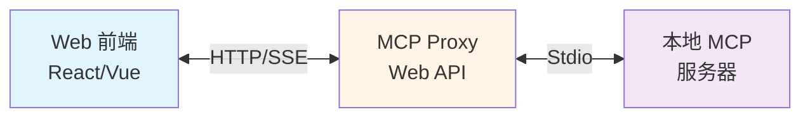
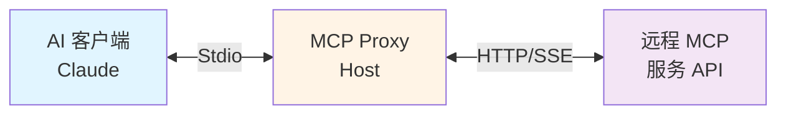
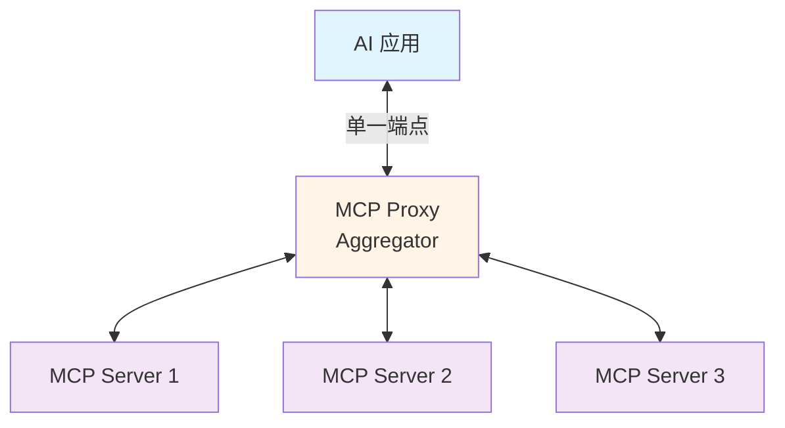

# MCP Proxy

[](https://dotnet.microsoft.com/)
[](LICENSE)
[](https://github.com/your-org/mcp-proxy)

> **一个基于 .NET 10 的高性能 Model Context Protocol (MCP) 代理服务**

MCP Proxy 是一个生产就绪的协议转换和聚合代理，支持将 Stdio MCP 服务器暴露为 HTTP/SSE API，或将远程 SSE MCP 服务器转换为本地 Stdio 接口。

---

## ✨ 核心特性

- 🔄 **双向协议转换**
  - Stdio → HTTP/SSE：将本地 MCP 服务器暴露为 Web API
  - SSE → Stdio：将远程 MCP API 转换为本地 Stdio 接口

- 🎯 **多服务器聚合**
  - 统一聚合多个 MCP 服务器到单一端点
  - 智能命名空间管理（可选前缀）
  - 动态服务器过滤和路由

- 🔐 **企业级安全**
  - OAuth2 客户端凭据流支持
  - Bearer Token 认证
  - CORS 配置
  - HTTPS 支持

- 🚀 **生产就绪**
  - 自动健康检查
  - 优雅启动和关闭
  - 自动重连机制
  - 完善的日志和监控

- 📦 **灵活部署**
  - Docker 容器化
  - Kubernetes 原生支持
  - Windows/Linux 系统服务
  - 独立可执行文件

---

## 🏗️ 系统架构

### 应用场景

#### 场景 1: Web 应用集成 (Stdio → HTTP/SSE)



#### 场景 2: 远程服务代理 (SSE → Stdio)



#### 场景 3: 服务聚合



---

## 🚀 快速开始

### 前置要求

- [.NET 10 Runtime](https://dotnet.microsoft.com/download/dotnet/10.0) 或更高版本
- Node.js（如果使用基于 Node 的 MCP 服务器）

### 方式 1: 从源码运行

```bash
# 克隆仓库
git clone https://github.com/your-org/mcp-proxy.git
cd mcp-proxy

# 运行 Web API (Stdio → HTTP/SSE)
cd src/McpProxy.StdioToSse.WebApi
dotnet run

# 访问 Swagger UI: http://localhost:3000
```

### 方式 2: 使用 Docker

```bash
# 拉取镜像
docker pull your-org/mcp-proxy:latest

# 运行容器
docker run -d \
  -p 3000:3000 \
  -v $(pwd)/appsettings.json:/app/appsettings.json \
  your-org/mcp-proxy:latest

# 访问: http://localhost:3000
```

### 方式 3: 发布为独立可执行文件

```bash
# 发布（Windows x64）
dotnet publish -c Release -r win-x64 --self-contained

# 发布（Linux x64）
dotnet publish -c Release -r linux-x64 --self-contained

# 运行
./publish/McpProxy.StdioToSse.WebApi
```

---

## ⚙️ 基础配置

### Web API 配置 (Stdio → HTTP/SSE)

创建 `appsettings.json`:

```json
{
  "HttpServer": {
    "Host": "localhost",
    "Port": 3000,
    "Stateless": false,
    "AllowedOrigins": ["*"]
  },
  "McpServers": [
    {
      "Name": "filesystem",
      "Command": "npx",
      "Arguments": ["-y", "@modelcontextprotocol/server-filesystem", "/path/to/directory"],
      "Enabled": true
    },
    {
      "Name": "github",
      "Command": "npx",
      "Arguments": ["-y", "@modelcontextprotocol/server-github"],
      "Environment": {
        "GITHUB_TOKEN": "your-token-here"
      },
      "Enabled": true
    }
  ],
  "UseNamespacePrefix": true,
  "AllowServerFilter": true,
  "AutoReconnect": true,
  "HealthCheckInterval": 30
}
```

### Host Service 配置 (SSE → Stdio)

创建 `appsettings.json`:

```json
{
  "SseClient": {
    "Url": "https://api.example.com/mcp/sse",
    "AccessToken": "your-bearer-token",
    "VerifySsl": true,
    "OAuth2": {
      "ClientId": "your-client-id",
      "ClientSecret": "your-client-secret",
      "TokenUrl": "https://auth.example.com/oauth/token",
      "Scope": "mcp.read mcp.write"
    }
  }
}
```

---

## 🎯 使用示例

### 列出所有工具

```bash
# 列出所有服务器的工具
curl -X POST http://localhost:3000/api/mcp/tools/list

# 列出特定服务器的工具
curl -X POST "http://localhost:3000/api/mcp/tools/list?server=filesystem"
```

### 调用工具

```bash
curl -X POST http://localhost:3000/api/mcp/tools/call \
  -H "Content-Type: application/json" \
  -d '{
    "name": "filesystem:read_file",
    "arguments": {
      "path": "/etc/hosts"
    }
  }'
```

### 获取服务器状态

```bash
curl http://localhost:3000/api/servers
```

### 健康检查

```bash
curl http://localhost:3000/health
```

---

## 📚 文档

完整文档位于 `docs/` 目录：

| 文档 | 说明 | 面向对象 |
|------|------|---------|
| **[用户指南](docs/USER_GUIDE.md)** | 安装、配置、使用、部署 | 用户、运维人员 |
| **[开发指南](docs/DEVELOPMENT.md)** | 开发环境、构建、测试、贡献 | 开发者、贡献者 |
| **[架构设计](docs/ARCHITECTURE.md)** | 系统架构、设计模式、技术选型 | 架构师、技术负责人 |

### 快速导航

- **安装部署**: [用户指南 - 快速开始](docs/USER_GUIDE.md#1-快速开始)
- **配置说明**: [用户指南 - 配置说明](docs/USER_GUIDE.md#2-配置说明)
- **API 参考**: [用户指南 - API 参考](docs/USER_GUIDE.md#4-api-参考)
- **故障排除**: [用户指南 - 故障排除](docs/USER_GUIDE.md#6-故障排除)
- **开发环境**: [开发指南 - 开发环境](docs/DEVELOPMENT.md#2-开发环境)
- **架构概述**: [架构设计 - 系统概述](docs/ARCHITECTURE.md#1-系统概述)

---

## 🏢 项目结构

```
mcp_proxy/
├── src/
│   ├── McpProxy.Abstractions/      # 抽象层：接口和模型定义
│   ├── McpProxy.Core/               # 业务层：核心服务和配置
│   ├── McpProxy.StdioToSse.WebApi/ # Web API：Stdio → HTTP/SSE
│   ├── McpProxy.SseToStdio.Host/   # Host Service：SSE → Stdio
│   └── McpProxy.Cli/                # CLI：命令行接口（向后兼容）
├── tests/
│   └── McpProxy.Tests/              # 单元测试和集成测试
├── docs/
│   ├── USER_GUIDE.md                # 用户指南
│   ├── DEVELOPMENT.md               # 开发指南
│   └── ARCHITECTURE.md              # 架构设计文档
└── README.md                        # 本文档
```

---

## 🔧 命令行接口 (CLI)

MCP Proxy 提供 CLI 用于向后兼容和简单场景：

```bash
# Stdio to SSE 模式
dotnet run --project src/McpProxy.Cli stdio-to-sse npx -y @modelcontextprotocol/server-everything --port 3000

# SSE to Stdio 模式
dotnet run --project src/McpProxy.Cli sse-to-stdio https://api.example.com/mcp/sse --access-token your-token

# 使用配置文件
dotnet run --project src/McpProxy.Cli config appsettings.json
```

详见 [开发指南 - CLI 使用](docs/DEVELOPMENT.md#5-cli-使用)。

---

## 🐳 Docker 部署

### Docker Run

```bash
docker build -t mcp-proxy:latest .
docker run -d -p 3000:3000 --name mcp-proxy mcp-proxy:latest
```

### Docker Compose

```yaml
version: '3.8'
services:
  mcp-proxy:
    image: mcp-proxy:latest
    ports:
      - "3000:3000"
    volumes:
      - ./appsettings.json:/app/appsettings.json:ro
    environment:
      - ASPNETCORE_ENVIRONMENT=Production
    restart: unless-stopped
```

详见 [用户指南 - Docker 部署](docs/USER_GUIDE.md#51-docker-部署)。

---

## ☸️ Kubernetes 部署

```bash
# 应用部署配置
kubectl apply -f k8s/deployment.yaml
kubectl apply -f k8s/service.yaml

# 查看状态
kubectl get pods
kubectl get svc
```

详见 [用户指南 - Kubernetes 部署](docs/USER_GUIDE.md#52-kubernetes-部署)。

---

## 🧪 运行测试

```bash
# 运行所有测试
dotnet test

# 运行特定测试
dotnet test --filter "FullyQualifiedName~StdioToSseServiceTests"

# 生成覆盖率报告
dotnet test --collect:"XPlat Code Coverage"
```

详见 [开发指南 - 测试](docs/DEVELOPMENT.md#4-测试)。

---

## 🤝 贡献

我们欢迎各种形式的贡献！请查看 [开发指南 - 贡献指南](docs/DEVELOPMENT.md#6-贡献指南) 了解：

- 代码规范
- 提交规范
- Pull Request 流程
- 开发最佳实践

### 快速贡献流程

1. Fork 本仓库
2. 创建特性分支: `git checkout -b feature/my-feature`
3. 提交更改: `git commit -m 'feat: add some feature'`
4. 推送到分支: `git push origin feature/my-feature`
5. 提交 Pull Request

---

## 📄 许可证

本项目采用 [MIT 许可证](LICENSE)。

---

## 🔗 相关链接

- [Model Context Protocol 官方网站](https://modelcontextprotocol.io/)
- [MCP 规范文档](https://spec.modelcontextprotocol.io/)
- [.NET 10 文档](https://docs.microsoft.com/dotnet/core)
- [ASP.NET Core 文档](https://docs.microsoft.com/aspnet/core)

---

## 📮 支持与反馈

- **Bug 报告**: [GitHub Issues](https://github.com/your-org/mcp-proxy/issues)
- **功能请求**: [GitHub Discussions](https://github.com/your-org/mcp-proxy/discussions)
- **技术支持**: [开发指南 - 故障排除](docs/DEVELOPMENT.md#7-故障排除)

---

## 🌟 Star History

如果这个项目对你有帮助，请给我们一个 ⭐️！

---

**维护团队**: MCP Proxy Team  
**更新频率**: 持续更新  
**项目状态**: 生产就绪 ✅
