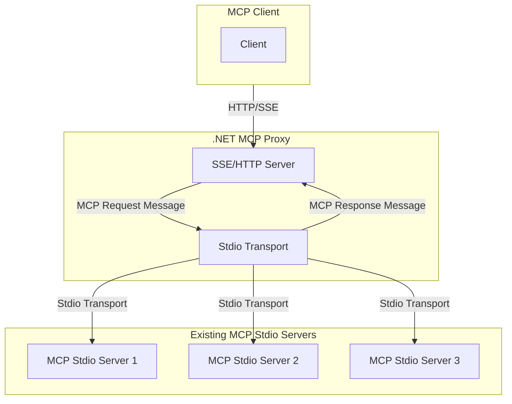

# MCP Proxy

## Architecture

```mermaid

flowchart TD
    subgraph C [MCP Client]
        Client
    end

    subgraph B [.NET MCP Proxy]
        B1[SSE/HTTP Server]
        B2[Stdio Transport]
        B1 -- MCP Request Message --> B2
        B2 -- MCP Response Message --> B1
    end

    subgraph S [Existing MCP Stdio Servers]
        S1[MCP Stdio Server 1]
        S2[MCP Stdio Server 2]
        S3[MCP Stdio Server 3]
    end

    C -- HTTP/SSE --> B1
    B2 -- Stdio Transport --> S1
    B2 -- Stdio Transport --> S2
    B2 -- Stdio Transport --> S3
```